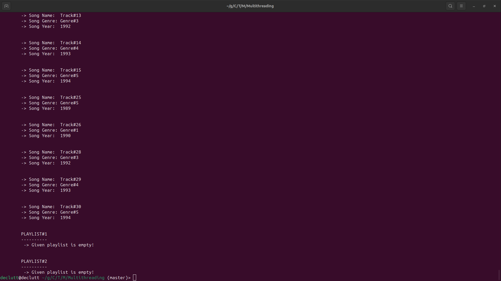
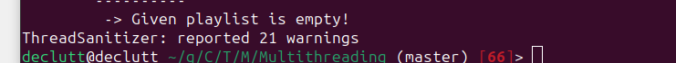
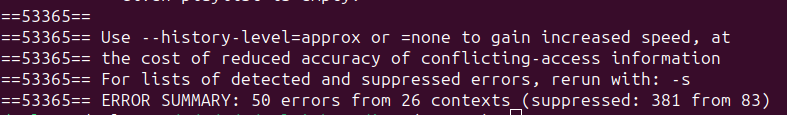
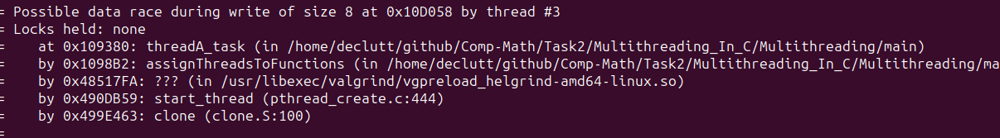
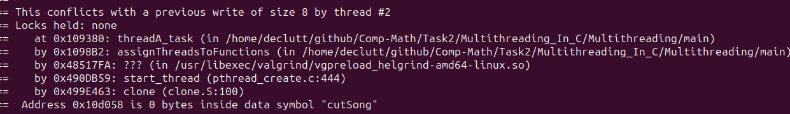
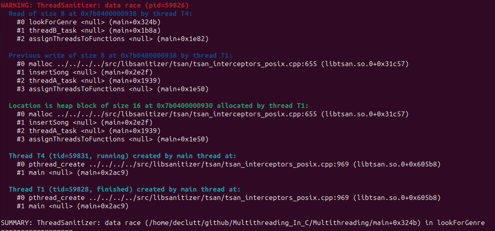

# TASK 2. Инструменты анализа кода

Возьмите любой проект с открытым исходным кодом на C/C++ без элементов OpenMP,
содержащий элементы параллельного программирования. Проанализируйте его
(насколько это возможно, всесторонне) с помощью инструментов Helgrind и
ThreadSanitizer или их аналогом. 

Какие предупреждения выдаёт инструмент? Указывают ли они на реальную проблему
или хотя бы на ту, которая потенциально может возникнуть?

Далее необходимо внести в проект некоторую гонку данных (не совсем уж
искусственную) и обнаружить её с помощью инструмента.

Комментарий. Язык программирования — C/С++ в силу особенностей инструмента

# Выбранный проект

Для выполнения задачи был взят следующий [проект](https://github.com/kaanalgan/Multithreading_In_C/tree/master/Multithreading). 

# План действий 

- Стандартный запуск
- Запуск с инструментами анализа кода ThreadSanitizer и Helgrind
- Запуск с теми же инструментами, но с введенной гонкой данных 

# Стандартный запуск 

Приложение было скомпилировано следующей командой:

    $ gcc main.c song.c linkedlist.c -o main -lpthread

Вывод стандартный, приложение отработало без ошибок и исключений. Вывод слишком большой, поэтому приведена только его часть.

# Запуск не изменённого кода с анализаторами

команда: 

    $ gcc -fsanitize=thread main.c song.c linkedlist.c -o main -lpthread

Никаких замечаний от анализатора сделано не было. 

Запуск с Helgrind производлися командой 

    $ valgrind --tool=helgrind ./main

Он также ожидаемо не выдал ошибки. 

# Запуск изменённого кода 

При изменении кода и искуственном добавлении гонки данных ThreadSanititzer выдал 21 предпреждение

Аблсолютно все они относились к обращению к assignThreadsToFunctions()

Helgrind же выдал 50 ошибок  

Все сообщения этого инструмента указывали на гонку данных 

И на последующим за этим конфликтом 

# Вывод 

Исходные результаты проверки проекта не выявили случаев гонок данных. Для дальнейшей проверки были внесены определенные изменения. После внесения этих изменений была запущена повторная проверка, в результате которой было обнаружено наличие гонки данных. 

Указания на assignThreadsToFunctions() было потому что: 
- Поток T1 выполнил запись размером 8 байт по адресу 0x7b0400000938.
- Поток T4 выполнил чтение размером 8 байт по тому же адресу 0x7b0400000938.
- Этот доступ произошел во время выполнения функции lookForGenre.

